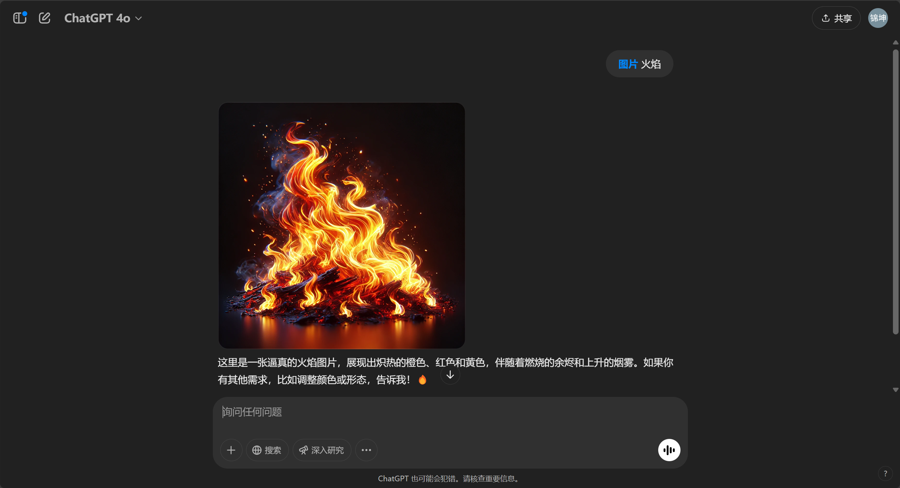

# FlameDiff: Flame Field based Diffusion Model

As you know, AI can paint:



What if we want AI to paint a real turbulant flame field? This make sense!


## Running the code

### Prerequisites

Install the required enviroment:
```
conda create -f environment.yml
```

### Running the code

The training process is based on `pytorch` and `pytorch-lightning`. All the configurations are stored in the `config` folder and will be arranged by `hydra`.

Before running the training process, modify the `config/default_training.yaml` file to fit your own data path. `cache_path` should be the directory where `T1030` and similar folders are stored. For more information about the parameters in the config, look at the `xxx_training.py` for what parameters are used. Also, you may need to modify the variable `devices` in the training python script to fit your hardware. The experiments are conducted on 8 * 3090 GPUs.

To train the `autoencoder` model, run the following command:

```
python encoder_training.py exp_name=autoencoder trainer.max_epochs=100
```

To train the `flame` model, run the following command:

```
python vit_training.py exp_name=vit trainer.max_epochs=10000
```
